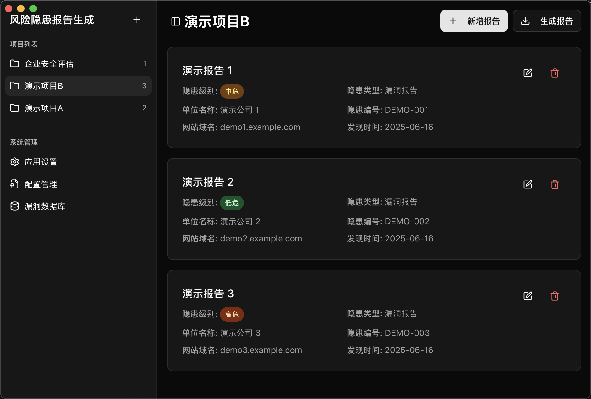
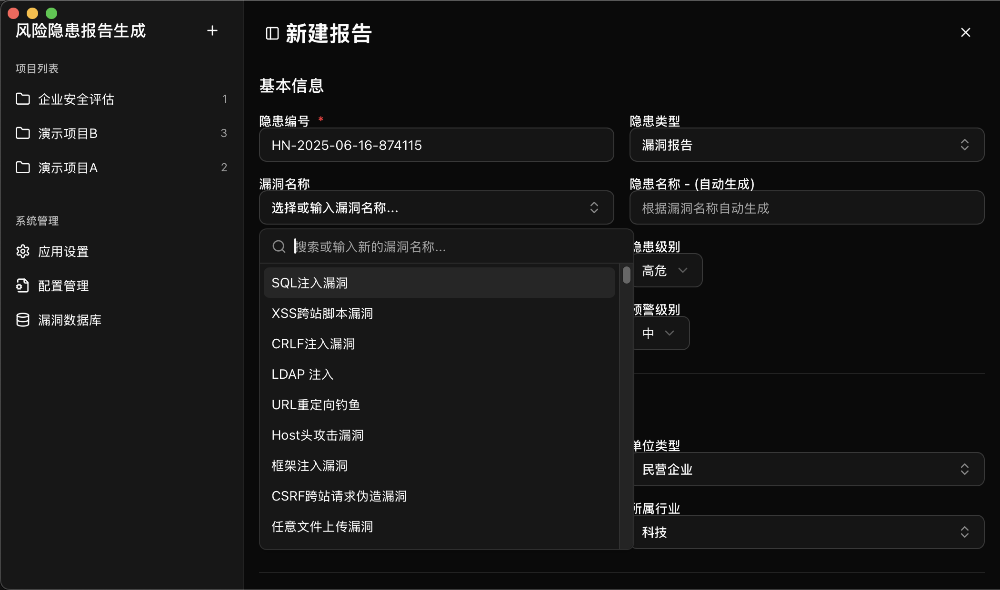

# 风险隐患报告生成器


一个基于 Tauri + Next.js 构建的现代化风险隐患报告管理与生成应用，专为网络安全评估、系统安全审计等场景设计。

## 📖 项目简介

风险隐患报告生成器是一款专业的安全报告管理工具，支持创建、编辑、管理多个安全评估项目，并能一键生成规范的 Word 格式报告文档。应用采用现代化的桌面端架构，提供流畅的用户体验和丰富的功能特性。






## ✨ 主要功能

### 🚀 核心功能

- **📂 项目管理**: 创建、删除、重命名多个项目，支持项目间切换
- **📝 报告编辑**: 可视化表单界面，支持丰富的字段类型和数据验证
- **📊 数据管理**: 智能的隐患类型、行业分类、单位类型等配置管理
- **🔍 漏洞数据库**: 内置常见漏洞类型，支持自定义扩展
- **📄 文档生成**: 一键生成专业的 Word 格式安全报告
- **💾 数据持久化**: 本地化数据存储，保障数据安全

### 🎯 特色功能

- **🖼️ 多媒体支持**: 支持图片和文本混合的证据截图管理
- **🔄 自动填充**: 根据漏洞类型自动填充问题描述和修复建议
- **📋 配置管理**: 可自定义的隐患类型、行业分类等基础配置
- **🌓 主题切换**: 支持明暗主题模式

## 🛠️ 技术栈

### 前端技术
- **React 19** - 现代化前端框架
- **Next.js 15** - 全栈 React 框架
- **TypeScript** - 类型安全的 JavaScript
- **Tailwind CSS** - 实用优先的 CSS 框架
- **Shadcn UI** - UI 组件库
- **Lucide React** - 现代化图标库

### 后端技术
- **Tauri** - 安全的桌面应用框架
- **Rust** - 系统级编程语言
- **docx-rs** - Word 文档生成库

### 开发工具
- **Bun** - 快速的 JavaScript 运行时
- **ESLint** - 代码质量检查

## 📦 安装说明

### 开发环境搭建

1. **安装依赖软件**
   ```bash
   # 安装 Rust (如果未安装)
   curl --proto '=https' --tlsv1.2 -sSf https://sh.rustup.rs | sh
   
   # 安装Tauri依赖
   cargo install create-tauri-app --locked

   # 安装 Bun (推荐)
   curl -fsSL https://bun.sh/install | bash
   
   # 或使用 npm
   npm install -g npm@latest
   ```

2. **克隆项目**
   ```bash
   git clone https://github.com/shuaihaoV/ReportGeneratorNext.git
   cd ReportGeneratorNext
   ```

3. **安装项目依赖**
   ```bash
   # 使用 Bun (推荐)
   bun install
   
   # 或使用 npm
   npm install
   ```

### 构建发布版本

```bash
# 构建应用
cargo tauri build 
```

## ⚙️ 配置说明

### 应用配置

配置文件位置：
- **Tauri 配置**: `src-tauri/tauri.conf.json`
- **Next.js 配置**: `next.config.ts`
- **TypeScript 配置**: `tsconfig.json`
- **初始化数据**: `init.json`

### 数据存储

应用使用 Tauri Store 插件进行本地数据持久化：
- **项目数据**: 存储在用户数据目录
- **配置信息**: 自动保存用户偏好设置
- **漏洞数据库**: 可扩展的本地数据库

### 权限配置

应用需要以下系统权限：
- **文件系统访问**: 读取图片文件、保存报告文档
- **对话框权限**: 文件选择和保存对话框
- **存储权限**: 本地数据持久化

## 🤝 贡献指南

欢迎对项目进行贡献！请遵循以下步骤：

1. **Fork 项目**
2. **创建特性分支** (`git checkout -b feature/AmazingFeature`)
3. **提交更改** (`git commit -m 'Add some AmazingFeature'`)
4. **推送到分支** (`git push origin feature/AmazingFeature`)
5. **开启 Pull Request**

### 开发规范

- 使用 TypeScript 进行类型安全开发
- 遵循 ESLint 代码规范
- 编写清晰的提交信息
- 添加必要的注释和文档

## 🐛 问题反馈

如果您在使用过程中遇到问题，请通过以下方式反馈：

- **GitHub Issues**: [提交问题](https://github.com/shuaihaoV/ReportGeneratorNext/issues)
- **功能建议**: 欢迎提出新功能建议
- **Bug 报告**: 请提供详细的复现步骤

## 📄 许可证

本项目采用 [MIT 许可证](LICENSE) - 详情请查看 LICENSE 文件

## 🙏 致谢

感谢以下开源项目的支持：
- [s1g0day/ReportGenX](https://github.com/s1g0day/ReportGenX) - 渗透测试报告生成工具
- [Tauri](https://tauri.app/) - 现代化桌面应用框架
- [Next.js](https://nextjs.org/) - React 全栈框架
- [Radix UI](https://www.radix-ui.com/) - 无障碍组件库
- [Tailwind CSS](https://tailwindcss.com/) - 实用优先的 CSS 框架
- [Lucide](https://lucide.dev/) - 精美的图标库

---

⭐ 如果这个项目对您有帮助，请给我们一个 Star！
